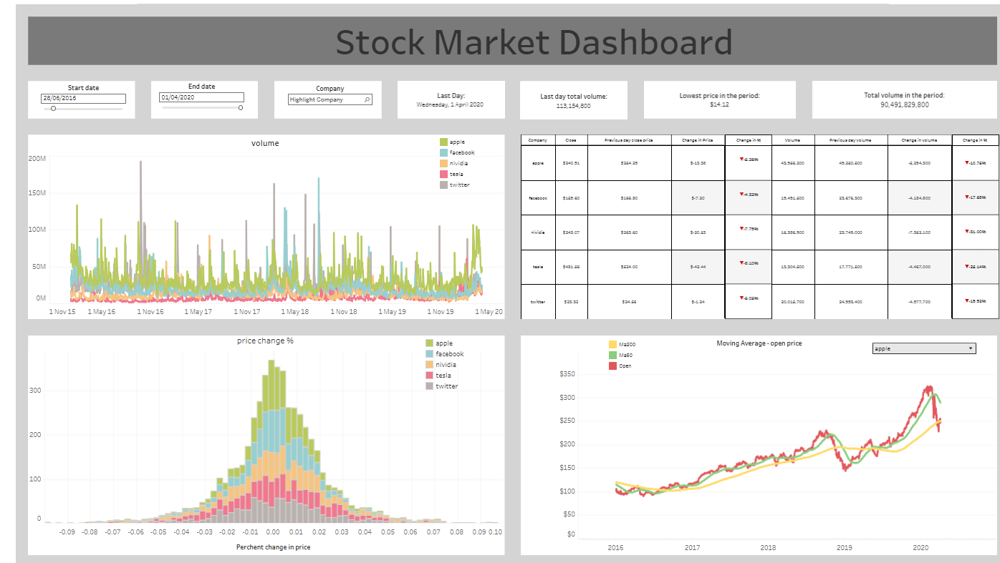

# 📈 Stock Market Dashboard

### 📊 Financial Market Analysis & Tracking
*A comprehensive interactive dashboard for analyzing historical stock performance, volume trends, and moving averages for major tech companies.*

---

## 🔗 Live Dashboard

---

## 📋 Project Overview
This project features an interactive **Stock Market Dashboard** designed to monitor and analyze the historical market data of top-tier technology stocks: **Apple, Facebook, Nvidia, Tesla, and Twitter**. 

Covering a multi-year period (specifically highlighted from mid-2016 to April 2020), the dashboard provides investors and analysts with a macro and micro view of stock behaviors, price volatility, and trading volumes.

---

## ⚙️ Interactive Controls & Filters
The dashboard empowers users to slice and dice the data dynamically:
* **Date Range Slicers:** Custom `Start date` and `End date` inputs to isolate specific market periods.
* **Company Highlighter:** A search/dropdown feature to highlight specific companies across global charts.
* **Moving Average Selector:** A dedicated dropdown to select an individual stock (e.g., Apple) for deep-dive technical analysis.

---

## 📊 Core Metrics (KPIs)
At a glance, the top summary cards display critical market indicators for the selected timeframe:
* **Last Day Total Volume:** Total shares traded on the most recent day in the selection (e.g., `113,154,800`).
* **Lowest Price in the Period:** The absolute minimum trading price reached (`$14.12`).
* **Total Volume in the Period:** The aggregate trading volume over the entire selected date range (`90,491,829,800`).

---

## 🔍 Visualizations & Technical Analysis

### 1. Trading Volume Over Time (Line Chart)
* Displays the daily trading volume for all tracked companies simultaneously.
* Helps identify massive volume spikes, market sell-offs, or periods of high accumulation.

### 2. Daily Performance Summary (Data Matrix)
A detailed table comparing the "Last Day" metrics against the "Previous Day" for each stock, including:
* Close Price vs. Previous Close.
* Absolute Price Change ($) and Percentage Change (%).
* Trading Volume vs. Previous Volume.
* Conditional formatting (Red/Green indicators) for quick trend recognition.

### 3. Price Change Distribution (Stacked Histogram)
* Visualizes the **Percentage Change in Price** across all companies.
* Shows the frequency distribution of daily returns, helping assess the overall volatility and risk profile of the tracked portfolio.

### 4. Technical Indicators: Moving Averages (Line Chart)
* Tracks the **Open Price** of a specifically selected company against key technical indicators.
* **Ma50 (50-Day Moving Average):** Indicates the short-to-medium term trend.
* **Ma200 (200-Day Moving Average):** Indicates the long-term macroeconomic trend.
* Useful for identifying "Golden Crosses" or "Death Crosses" in stock performance.

---
*Dashboard design focuses on clear data visualization, actionable financial metrics, and seamless user interaction.*
